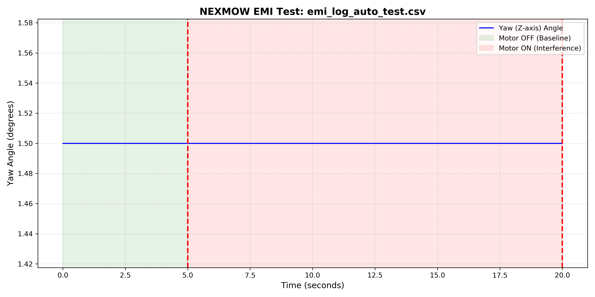

# Mower-ROS-Control-Stack 

This is my development workspace for the **NEXMOW robotic mower**. It’s where I’m building the brain to make the machine smarter and more precise.

## Why this project?
I am a **Mechanical Engineering student at NTU**. Before this, my world was mostly about CAD, thermodynamics, and physical structures. I had zero experience with ROS, Python-based remote control, or sensor fusion. But I noticed a problem: the mower drifts, and the trajectory was kinda ass. I realized that no amount of mechanical tweaking could fix it, I had to dive into the software side. This repo is a record of me **learning robotics from scratch** to solve real-world hardware headaches.

##  Current Focus: Fixing the drift
Right now, I’m tackling the most frustrating part: **Heading Stabilization.**

* **The Issue:** My guess is, when the mower’s blades start spinning, they create **Electromagnetic Interference**. This makes the magnetometer go crazy, causing the mower to drift off-course.
* **What I’ve built:** - `mag_interference_logger.py`: An automated script to profile motor noise with precision timing.
    - `filter_stability_test.py`: A diagnostic tool to calculate sensor RMS noise and stability.
* **The Goal:** Use IMU data to compensate for that noise so the mower can actually drive in a straight line on the grass.

##  Results & Visualization
The stack includes a dedicated visualization tool (`plot_emi.py`) to analyze the logged data. Below is a sample result from a simulated run:

##  What's Next?
Once I get the steering stable, I’m moving on to challenges that currently represent a significant learning curve for me:
1.  **Ultrasonic Avoidance:** Wiring up the sensor arrays so the mower stops hitting things and starts dodging them.
2.  **Vision-Based Autonomy:** Teaching myself OpenCV and basic perception logic to recognize grass boundaries.
